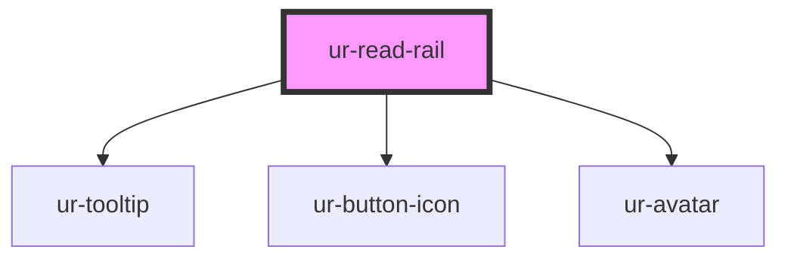

# ur-read-rail-desktop

<!-- Auto Generated Below -->

## Properties

| Property             | Attribute              | Description | Type                   | Default     |
| -------------------- | ---------------------- | ----------- | ---------------------- | ----------- |
| `avatarName`         | `avatar-name`          |             | `string`               | `undefined` |
| `avatarSrc`          | `avatar-src`           |             | `string`               | `undefined` |
| `comments`           | `comments`             |             | `number`               | `undefined` |
| `dislike`            | `dislike`              |             | `string`               | `'Dislike'` |
| `donate`             | `donate`               |             | `string`               | `'Donate'`  |
| `isAuthorFollowed`   | `is-author-followed`   |             | `boolean`              | `false`     |
| `isAuthorPro`        | `is-author-pro`        |             | `boolean`              | `false`     |
| `isChapterPurchased` | `is-chapter-purchased` |             | `boolean`              | `false`     |
| `isDonationsEnabled` | `is-donations-enabled` |             | `boolean`              | `true`      |
| `isFollowed`         | `is-followed`          |             | `boolean`              | `false`     |
| `isHostSmall`        | `is-host-small`        |             | `boolean`              | `undefined` |
| `isNovlDeleted`      | `is-novl-deleted`      |             | `boolean`              | `false`     |
| `isOwnChapter`       | `is-own-chapter`       |             | `boolean`              | `false`     |
| `isPaidChapter`      | `is-paid-chapter`      |             | `boolean`              | `false`     |
| `isVisible`          | `is-visible`           |             | `boolean`              | `true`      |
| `likes`              | `likes`                |             | `number`               | `undefined` |
| `mode`               | `mode`                 |             | `"desktop" \| "ionic"` | `'desktop'` |
| `share`              | `share`                |             | `string`               | `'Share'`   |

## Events

| Event                  | Description | Type                   |
| ---------------------- | ----------- | ---------------------- |
| `commentClicked`       |             | `CustomEvent<void>`    |
| `dislikeClicked`       |             | `CustomEvent<boolean>` |
| `donateClicked`        |             | `CustomEvent<void>`    |
| `facebookShareClicked` |             | `CustomEvent<void>`    |
| `followClicked`        |             | `CustomEvent<void>`    |
| `likeClicked`          |             | `CustomEvent<boolean>` |
| `linkedinShareClicked` |             | `CustomEvent<void>`    |
| `nativeShareClicked`   |             | `CustomEvent<void>`    |
| `shareClicked`         |             | `CustomEvent<void>`    |
| `twitterShareClicked`  |             | `CustomEvent<void>`    |
| `viewProfileClicked`   |             | `CustomEvent<void>`    |
| `visibilityToggled`    |             | `CustomEvent<boolean>` |

## Dependencies

### Depends on

- [ur-tooltip](../ur-tooltip)
- [ur-button-icon](../ur-button-icon)
- [ur-avatar](../ur-avatar)

### Graph

----------------------------------------------

*Built with [StencilJS](https://stenciljs.com/)*
