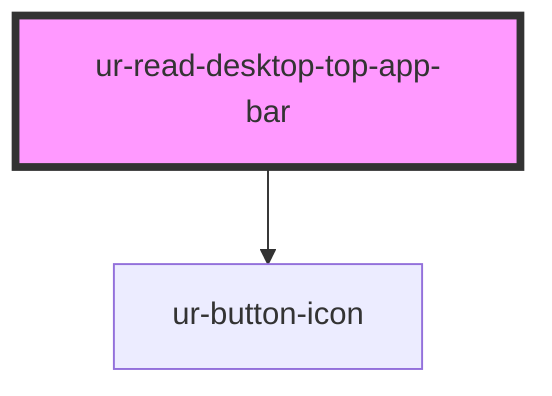

# ur-read-desktop-top-app-bar

<!-- Auto Generated Below -->

## Properties

| Property          | Attribute          | Description                                                | Type                              | Default     |
| ----------------- | ------------------ | ---------------------------------------------------------- | --------------------------------- | ----------- |
| `novelTitle`      | `novel-title`      | Title of the novel                                         | `string`                          | `undefined` |
| `scrollBehavior`  | `scroll-behavior`  | Behavior of the top app bar on scroll                      | `"elevate" \| "hide" \| "shrink"` | `'hide'`    |
| `scrollThreshold` | `scroll-threshold` | Scroll threshold in pixels (default: 50)                   | `number`                          | `50`        |
| `variant`         | `variant`          | Variant of the top app bar (e.g., 'small', 'medium', etc.) | `"large" \| "medium" \| "small"`  | `'small'`   |

## Events

| Event                  | Description | Type                |
| ---------------------- | ----------- | ------------------- |
| `readingSettingsClick` |             | `CustomEvent<void>` |

## Dependencies

### Depends on

- [ur-button-icon](../ur-button-icon)

### Graph

----------------------------------------------

*Built with [StencilJS](https://stenciljs.com/)*
