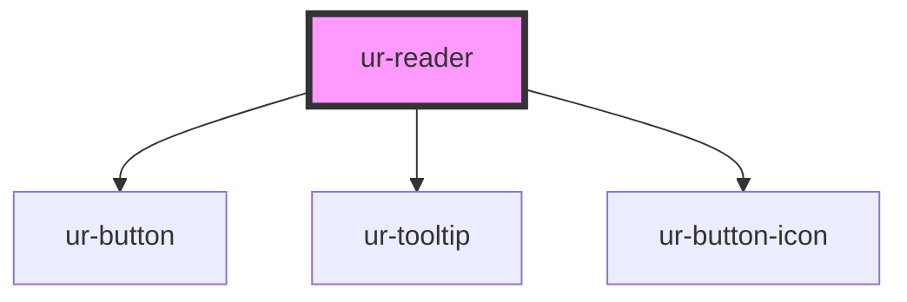

# ur-reader

<!-- Auto Generated Below -->

## Properties

| Property              | Attribute               | Description | Type                                                 | Default                                                |
| --------------------- | ----------------------- | ----------- | ---------------------------------------------------- | ------------------------------------------------------ |
| `avatarName`          | `avatar-name`           |             | `string`                                             | `'Jane Doe'`                                           |
| `avatarSrc`           | `avatar-src`            |             | `string`                                             | `'https://i.pravatar.cc/150?img=3'`                    |
| `chapterContent`      | `chapter-content`       |             | `string`                                             | `'
Default chapter content.
'`                    |
| `chapterLocked`       | `chapter-locked`        |             | `boolean`                                            | `false`                                                |
| `chapterSequence`     | `chapter-sequence`      |             | `number`                                             | `1`                                                    |
| `chapterTitle`        | `chapter-title`         |             | `string`                                             | `'Default Chapter Title'`                              |
| `comments`            | `comments`              |             | `number`                                             | `15`                                                   |
| `dislike`             | `dislike`               |             | `string`                                             | `'Dislike'`                                            |
| `donate`              | `donate`                |             | `string`                                             | `'Donate'`                                             |
| `fontSize`            | `font-size`             |             | `"large" \| "medium" \| "small"`                     | `'medium'`                                             |
| `fontType`            | `font-type`             |             | `"monospace" \| "sans-serif" \| "serif" \| "system"` | `'sans-serif'`                                         |
| `hasNextChapter`      | `has-next-chapter`      |             | `boolean`                                            | `true`                                                 |
| `hasPreviousChapter`  | `has-previous-chapter`  |             | `boolean`                                            | `true`                                                 |
| `isAuthorFollowed`    | `is-author-followed`    |             | `boolean`                                            | `false`                                                |
| `isAuthorPro`         | `is-author-pro`         |             | `boolean`                                            | `false`                                                |
| `isChapterPurchased`  | `is-chapter-purchased`  |             | `boolean`                                            | `false`                                                |
| `isDonationsEnabled`  | `is-donations-enabled`  |             | `boolean`                                            | `false`                                                |
| `isNovlDeleted`       | `is-novl-deleted`       |             | `boolean`                                            | `false`                                                |
| `isOwnChapter`        | `is-own-chapter`        |             | `boolean`                                            | `false`                                                |
| `isVisible`           | `is-visible`            |             | `boolean`                                            | `true`                                                 |
| `likes`               | `likes`                 |             | `string`                                             | `'1.5k'`                                               |
| `loading`             | `loading`               |             | `boolean`                                            | `false`                                                |
| `lockedMessage`       | `locked-message`        |             | `string`                                             | `'This chapter is locked. Buy story to read chapter.'` |
| `minutesText`         | `minutes-text`          |             | `string`                                             | `'Minutes'`                                            |
| `nextChapterText`     | `next-chapter-text`     |             | `string`                                             | `'Next Chapter'`                                       |
| `previousChapterText` | `previous-chapter-text` |             | `string`                                             | `'Previous Chapter'`                                   |
| `readingDurationText` | `reading-duration-text` |             | `string`                                             | `'Reading Duration'`                                   |
| `readingTimePerWord`  | `reading-time-per-word` |             | `number`                                             | `0.3`                                                  |
| `share`               | `share`                 |             | `string`                                             | `'Share'`                                              |
| `storyTitle`          | `story-title`           |             | `string`                                             | `'Default Story Title'`                                |
| `unlockButtonLabel`   | `unlock-button-label`   |             | `string`                                             | `'Buy and Unlock'`                                     |

## Events

| Event                      | Description | Type                |
| -------------------------- | ----------- | ------------------- |
| `chapterUnlocked`          |             | `CustomEvent<void>` |
| `commentClicked`           |             | `CustomEvent<void>` |
| `dislikeClicked`           |             | `CustomEvent<void>` |
| `donateClicked`            |             | `CustomEvent<void>` |
| `followAuthorClicked`      |             | `CustomEvent<void>` |
| `likeClicked`              |             | `CustomEvent<void>` |
| `nextChapterClicked`       |             | `CustomEvent<void>` |
| `previousChapterClicked`   |             | `CustomEvent<void>` |
| `shareClicked`             |             | `CustomEvent<void>` |
| `viewAuthorProfileClicked` |             | `CustomEvent<void>` |

## Shadow Parts

| Part                           | Description |
| ------------------------------ | ----------- |
| `"chapter-navigation-buttons"` |             |

## Dependencies

### Depends on

- [ur-button](../ur-button)
- [ur-tooltip](../ur-tooltip)
- [ur-button-icon](../ur-button-icon)

### Graph

----------------------------------------------

*Built with [StencilJS](https://stenciljs.com/)*
