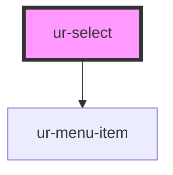

# ur-select

<!-- Auto Generated Below -->

## Properties

| Property      | Attribute     | Description | Type                                                  | Default        |
| ------------- | ------------- | ----------- | ----------------------------------------------------- | -------------- |
| `clearable`   | `clearable`   |             | `boolean`                                             | `false`        |
| `disabled`    | `disabled`    |             | `boolean`                                             | `false`        |
| `endAligned`  | `end-aligned` |             | `boolean`                                             | `false`        |
| `endIcon`     | `end-icon`    |             | `string`                                              | `null`         |
| `form`        | `form`        |             | `string`                                              | `null`         |
| `helper`      | `helper`      |             | `string`                                              | `null`         |
| `icon`        | `icon`        |             | `string`                                              | `null`         |
| `items`       | --            |             | `[label: string, value: string, disabled: boolean][]` | `[]`           |
| `label`       | `label`       |             | `string`                                              | `"Text Field"` |
| `multiple`    | `multiple`    |             | `boolean`                                             | `false`        |
| `name`        | `name`        |             | `string`                                              | `''`           |
| `placeholder` | `placeholder` |             | `string`                                              | `null`         |
| `placement`   | `placement`   |             | `"auto" \| "bottom" \| "top"`                         | `'auto'`       |
| `readonly`    | `readonly`    |             | `boolean`                                             | `false`        |
| `value`       | `value`       |             | `string \| string[]`                                  | `''`           |
| `variant`     | `variant`     |             | `"filled" \| "outlined"`                              | `'filled'`     |

## Events

| Event         | Description | Type                              |
| ------------- | ----------- | --------------------------------- |
| `itemClicked` |             | `CustomEvent<string \| string[]>` |

## Dependencies

### Depends on

- [ur-menu-item](../ur-menu-item)

### Graph

----------------------------------------------

*Built with [StencilJS](https://stenciljs.com/)*
