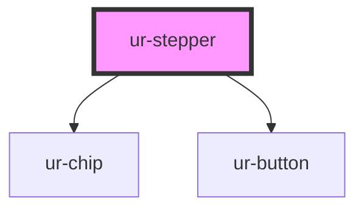

# ur-stepper

<!-- Auto Generated Below -->

## Properties

| Property              | Attribute               | Description                                             | Type       | Default      |
| --------------------- | ----------------------- | ------------------------------------------------------- | ---------- | ------------ |
| `allowStepNavigation` | `allow-step-navigation` | Whether completed steps can be clicked to navigate back | `boolean`  | `true`       |
| `completeButtonText`  | `complete-button-text`  | Text for the Complete button (last step)                | `string`   | `'Complete'` |
| `completeStepText`    | `complete-step-text`    | Text for the Complete step                              | `string`   | `'Complete'` |
| `completedStepIcon`   | `completed-step-icon`   | Icon to show for completed steps                        | `string`   | `'check'`    |
| `currentStep`         | `current-step`          | Currently active step (1-based index)                   | `number`   | `1`          |
| `customClass`         | `custom-class`          | Custom CSS class for styling                            | `string`   | `undefined`  |
| `nextButtonDisabled`  | `next-button-disabled`  | Whether the next button should be disabled              | `boolean`  | `false`      |
| `nextButtonText`      | `next-button-text`      | Text for the Next button                                | `string`   | `'Next'`     |
| `ongoingStepText`     | `ongoing-step-text`     | Text for the Ongoing step                               | `string`   | `'Ongoing'`  |
| `previousButtonText`  | `previous-button-text`  | Text for the Previous button                            | `string`   | `'Back'`     |
| `showStepNumbers`     | `show-step-numbers`     | Whether to show step numbers                            | `boolean`  | `true`       |
| `stepCount`           | `step-count`            | Number of steps in the stepper                          | `number`   | `3`          |
| `stepDescriptions`    | `step-descriptions`     | Step descriptions array                                 | `string[]` | `[]`         |
| `stepTitles`          | `step-titles`           | Step titles array                                       | `string[]` | `[]`         |

## Events

| Event               | Description                                | Type                                         |
| ------------------- | ------------------------------------------ | -------------------------------------------- |
| `allStepsCompleted` | Event emitted when all steps are completed | `CustomEvent<void>`                          |
| `stepChanged`       | Event emitted when step changes            | `CustomEvent<{ from: number; to: number; }>` |
| `stepCompleted`     | Event emitted when step is completed       | `CustomEvent<{ step: number; data?: any; }>` |

## Methods

### `goToStep(stepNumber: number) => Promise<void>`

Navigate to a specific step

#### Parameters

| Name         | Type     | Description |
| ------------ | -------- | ----------- |
| `stepNumber` | `number` |             |

#### Returns

Type: `Promise<void>`

### `markStepComplete(stepNumber: number) => Promise<void>`

Mark a step as completed

#### Parameters

| Name         | Type     | Description |
| ------------ | -------- | ----------- |
| `stepNumber` | `number` |             |

#### Returns

Type: `Promise<void>`

### `markStepInvalid(stepNumber: number) => Promise<void>`

Mark a step as invalid

#### Parameters

| Name         | Type     | Description |
| ------------ | -------- | ----------- |
| `stepNumber` | `number` |             |

#### Returns

Type: `Promise<void>`

### `reset() => Promise<void>`

Reset the stepper to first step

#### Returns

Type: `Promise<void>`

## Dependencies

### Depends on

- [ur-chip](../ur-chip)
- [ur-button](../ur-button)

### Graph

----------------------------------------------

*Built with [StencilJS](https://stenciljs.com/)*
