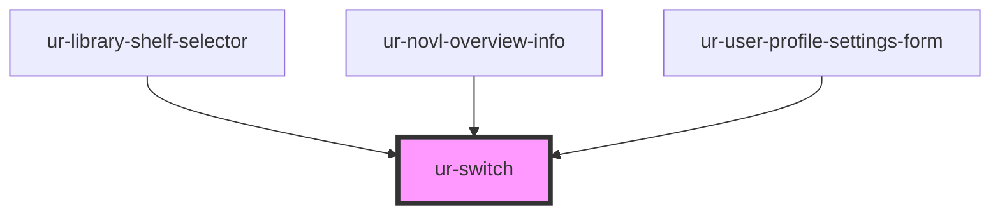

# ur-switch

<!-- Auto Generated Below -->

## Properties

| Property        | Attribute        | Description | Type      | Default     |
| --------------- | ---------------- | ----------- | --------- | ----------- |
| `checked`       | `checked`        |             | `boolean` | `false`     |
| `checkedIcon`   | `checked-icon`   |             | `string`  | `undefined` |
| `disabled`      | `disabled`       |             | `boolean` | `false`     |
| `uncheckedIcon` | `unchecked-icon` |             | `string`  | `undefined` |

## Events

| Event          | Description | Type                   |
| -------------- | ----------- | ---------------------- |
| `switchChange` |             | `CustomEvent<boolean>` |

## Dependencies

### Used by

 - [ur-library-shelf-selector](../ur-library-shelf-selector)
 - [ur-novl-overview-info](../ur-novl-overview-info)
 - [ur-user-profile-settings-form](../ur-user-profile-settings-form)

### Graph

----------------------------------------------

*Built with [StencilJS](https://stenciljs.com/)*
