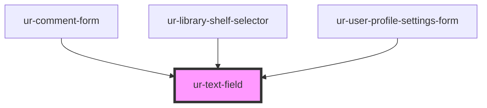

# ur-text-field

<!-- Auto Generated Below -->

## Properties

| Property       | Attribute       | Description | Type                     | Default        |
| -------------- | --------------- | ----------- | ------------------------ | -------------- |
| `autosize`     | `autosize`      |             | `boolean`                | `false`        |
| `counter`      | `counter`       |             | `boolean`                | `false`        |
| `disabled`     | `disabled`      |             | `boolean`                | `false`        |
| `endIcon`      | `end-icon`      |             | `string`                 | `null`         |
| `error`        | `error`         |             | `boolean`                | `false`        |
| `errorMessage` | `error-message` |             | `string`                 | `null`         |
| `helper`       | `helper`        |             | `string`                 | `null`         |
| `label`        | `label`         |             | `string`                 | `'text field'` |
| `max`          | `max`           |             | `number \| string`       | `null`         |
| `maxRows`      | `max-rows`      |             | `number`                 | `null`         |
| `maxlength`    | `maxlength`     |             | `number`                 | `null`         |
| `min`          | `min`           |             | `number \| string`       | `null`         |
| `minRows`      | `min-rows`      |             | `number`                 | `null`         |
| `minlength`    | `minlength`     |             | `number`                 | `null`         |
| `name`         | `name`          |             | `string`                 | `''`           |
| `pattern`      | `pattern`       |             | `string`                 | `null`         |
| `placeholder`  | `placeholder`   |             | `string`                 | `null`         |
| `required`     | `required`      |             | `boolean`                | `false`        |
| `rows`         | `rows`          |             | `number`                 | `null`         |
| `step`         | `step`          |             | `number \| string`       | `null`         |
| `type`         | `type`          |             | `string`                 | `'text'`       |
| `value`        | `value`         |             | `string`                 | `''`           |
| `variant`      | `variant`       |             | `"filled" \| "outlined"` | `'filled'`     |

## Events

| Event               | Description | Type                                                               |
| ------------------- | ----------- | ------------------------------------------------------------------ |
| `errorStateChanged` |             | `CustomEvent<{ name: string; error: boolean; message?: string; }>` |
| `valueChanged`      |             | `CustomEvent<{ name: string; value: string; }>`                    |

## Dependencies

### Used by

 - [ur-comment-form](../ur-comment-form)
 - [ur-library-shelf-selector](../ur-library-shelf-selector)
 - [ur-user-profile-settings-form](../ur-user-profile-settings-form)

### Graph

----------------------------------------------

*Built with [StencilJS](https://stenciljs.com/)*
