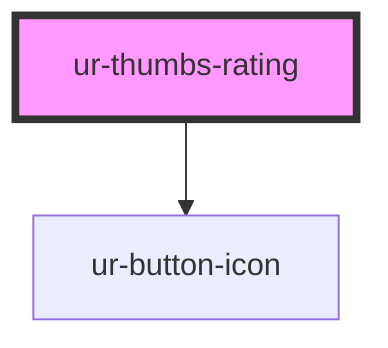

# ur-thumbs-rating

<!-- Auto Generated Below -->

## Properties

| Property      | Attribute      | Description | Type      | Default     |
| ------------- | -------------- | ----------- | --------- | ----------- |
| `dislikeText` | `dislike-text` |             | `string`  | `'Dislike'` |
| `isDisliked`  | `is-disliked`  |             | `boolean` | `false`     |
| `isLiked`     | `is-liked`     |             | `boolean` | `false`     |
| `likesCount`  | `likes-count`  |             | `number`  | `0`         |

## Events

| Event        | Description | Type                |
| ------------ | ----------- | ------------------- |
| `thumbsDown` |             | `CustomEvent<void>` |
| `thumbsUp`   |             | `CustomEvent<void>` |

## Dependencies

### Depends on

- [ur-button-icon](../ur-button-icon)

### Graph

----------------------------------------------

*Built with [StencilJS](https://stenciljs.com/)*
