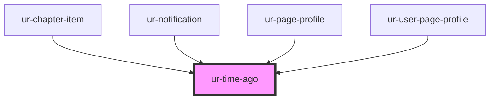

# ur-time-ago

<!-- Auto Generated Below -->

## Properties

| Property | Attribute | Description | Type     | Default     |
| -------- | --------- | ----------- | -------- | ----------- |
| `date`   | `date`    |             | `string` | `undefined` |

## Shadow Parts

| Part     | Description |
| -------- | ----------- |
| `"time"` |             |

## Dependencies

### Used by

 - [ur-chapter-item](../ur-chapter-item)
 - [ur-notification](../ur-notification)
 - [ur-page-profile](../ur-page-profile)
 - [ur-user-page-profile](../ur-user-page-profile)

### Graph

----------------------------------------------

*Built with [StencilJS](https://stenciljs.com/)*
