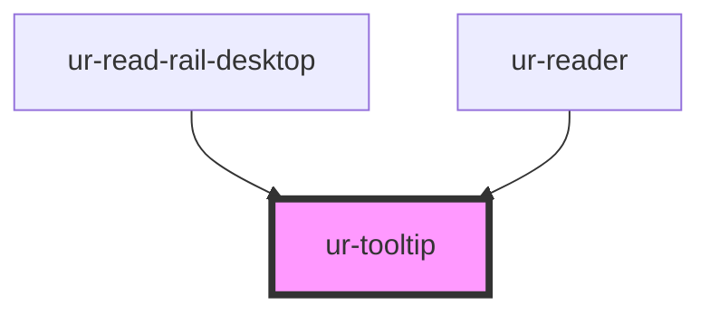

# ur-tooltip

<!-- Auto Generated Below -->

## Properties

| Property      | Attribute      | Description | Type                                                                                                                                                                                                                                           | Default          |
| ------------- | -------------- | ----------- | ---------------------------------------------------------------------------------------------------------------------------------------------------------------------------------------------------------------------------------------------- | ---------------- |
| `closeDelay`  | `close-delay`  |             | `number`                                                                                                                                                                                                                                       | `150`            |
| `colorScheme` | `color-scheme` |             | `"dark" \| "light"`                                                                                                                                                                                                                            | `'light'`        |
| `content`     | `content`      |             | `string`                                                                                                                                                                                                                                       | `'Tooltip text'` |
| `disabled`    | `disabled`     |             | `boolean`                                                                                                                                                                                                                                      | `false`          |
| `openDelay`   | `open-delay`   |             | `number`                                                                                                                                                                                                                                       | `0`              |
| `placement`   | `placement`    |             | `"auto" \| "bottom" \| "bottom-end" \| "bottom-left" \| "bottom-right" \| "bottom-start" \| "left" \| "left-end" \| "left-start" \| "right" \| "right-end" \| "right-start" \| "top" \| "top-end" \| "top-left" \| "top-right" \| "top-start"` | `'top'`          |
| `trigger`     | `trigger`      |             | `"click" \| "focus" \| "hover"`                                                                                                                                                                                                                | `'hover'`        |
| `variant`     | `variant`      |             | `"plain" \| "rich"`                                                                                                                                                                                                                            | `'plain'`        |

## Dependencies

### Used by

 - [ur-read-rail-desktop](../ur-read-rail-desktop)
 - [ur-reader](../ur-reader)

### Graph

----------------------------------------------

*Built with [StencilJS](https://stenciljs.com/)*
