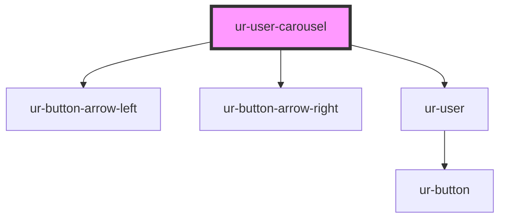

# ur-user-carousel

<!-- Auto Generated Below -->

## Properties

| Property        | Attribute         | Description | Type                                              | Default                                        |
| --------------- | ----------------- | ----------- | ------------------------------------------------- | ---------------------------------------------- |
| `breakpoints`   | --                |             | `{ [width: number]: any; [ratio: string]: any; }` | `{         // add default     }`               |
| `grid`          | --                |             | `{ rows?: number; fill?: "row" \| "column"; }`    | `{         rows: 1,         fill: 'row'     }` |
| `navigation`    | `navigation`      |             | `boolean`                                         | `false`                                        |
| `slidesPerView` | `slides-per-view` |             | `"auto" \| number`                                | `'auto'`                                       |
| `spaceBetween`  | `space-between`   |             | `number \| string`                                | `'0'`                                          |
| `users`         | --                |             | `(UserCustomContent \| User)[]`                   | `[]`                                           |

## Events

| Event                 | Description | Type                                       |
| --------------------- | ----------- | ------------------------------------------ |
| `intersectionUpdated` |             | `CustomEvent<IntersectionObserverEntry[]>` |
| `nextClicked`         |             | `CustomEvent<void>`                        |
| `prevClicked`         |             | `CustomEvent<void>`                        |

## Dependencies

### Depends on

- [ur-button-arrow-left](../ur-button-arrow-left)
- [ur-button-arrow-right](../ur-button-arrow-right)
- [ur-user](../ur-user)

### Graph

----------------------------------------------

*Built with [StencilJS](https://stenciljs.com/)*
