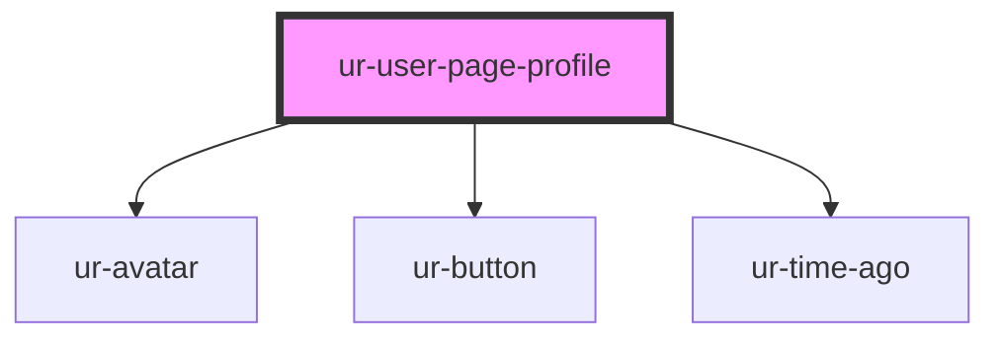

# ur-page-profile

<!-- Auto Generated Below -->

## Properties

| Property                 | Attribute                   | Description | Type                                               | Default              |
| ------------------------ | --------------------------- | ----------- | -------------------------------------------------- | -------------------- |
| `about`                  | `about`                     |             | `any`                                              | `null`               |
| `avatar`                 | `avatar`                    |             | `any`                                              | `undefined`          |
| `createdByText`          | `created-by-text`           |             | `string`                                           | `'Created by'`       |
| `donateText`             | `donate-text`               |             | `string`                                           | `'Donate'`           |
| `email`                  | `email`                     |             | `any`                                              | `null`               |
| `facebook_url`           | `facebook_url`              |             | `any`                                              | `null`               |
| `followText`             | `follow-text`               |             | `string`                                           | `'Follow'`           |
| `followers`              | `followers`                 |             | `number`                                           | `null`               |
| `followersText`          | `followers-text`            |             | `string`                                           | `'Followers'`        |
| `following`              | `following`                 |             | `number`                                           | `null`               |
| `followingText`          | `following-text`            |             | `string`                                           | `'Following'`        |
| `genres`                 | `genres`                    |             | `string`                                           | `null`               |
| `genresText`             | `genres-text`               |             | `string`                                           | `'Genres'`           |
| `isLoggedIn`             | `is-logged-in`              |             | `boolean`                                          | `true`               |
| `isProfileFollowed`      | `is-profile-followed`       |             | `boolean`                                          | `false`              |
| `isProfileOwner`         | `is-profile-owner`          |             | `boolean`                                          | `false`              |
| `isWriter`               | `is-writer`                 |             | `boolean`                                          | `false`              |
| `languages`              | `languages`                 |             | `string`                                           | `null`               |
| `languagesText`          | `languages-text`            |             | `string`                                           | `'Languages'`        |
| `linkedin_url`           | `linkedin_url`              |             | `any`                                              | `null`               |
| `literatureTypes`        | `literature-types`          |             | `string`                                           | `null`               |
| `literatureTypesText`    | `literature-types-text`     |             | `string`                                           | `'Literature Types'` |
| `location`               | `location`                  |             | `any`                                              | `null`               |
| `logoutText`             | `logout-text`               |             | `string`                                           | `'Logout'`           |
| `members`                | `members`                   |             | `number`                                           | `null`               |
| `name`                   | `name`                      |             | `any`                                              | `undefined`          |
| `pageCreatorImage`       | `page-creator-image`        |             | `any`                                              | `null`               |
| `pageCreatorName`        | `page-creator-name`         |             | `any`                                              | `null`               |
| `pagesFollowing`         | `pages-following`           |             | `number`                                           | `null`               |
| `pagesFollowingText`     | `pages-following-text`      |             | `string`                                           | `'Pages Following'`  |
| `platform`               | `platform`                  |             | `"desktop" \| "mobile-main" \| "mobile-secondary"` | `'desktop'`          |
| `readerText`             | `reader-text`               |             | `string`                                           | `'Reader'`           |
| `showBecomeMember`       | `show-become-member`        |             | `boolean`                                          | `false`              |
| `showDonate`             | `show-donate`               |             | `boolean`                                          | `false`              |
| `showFollow`             | `show-follow`               |             | `boolean`                                          | `false`              |
| `showSendMessage`        | `show-send-message`         |             | `boolean`                                          | `false`              |
| `stories`                | `stories`                   |             | `number`                                           | `null`               |
| `storiesText`            | `stories-text`              |             | `string`                                           | `'Stories'`          |
| `twitter_url`            | `twitter_url`               |             | `any`                                              | `null`               |
| `unFollowText`           | `un-follow-text`            |             | `string`                                           | `'Unfollow'`         |
| `userProfileCreatedDate` | `user-profile-created-date` |             | `any`                                              | `null`               |
| `userProfileCreatedText` | `user-profile-created-text` |             | `string`                                           | `'Joined'`           |
| `views`                  | `views`                     |             | `number`                                           | `null`               |
| `viewsText`              | `views-text`                |             | `string`                                           | `'Views'`            |
| `website`                | `website`                   |             | `any`                                              | `null`               |
| `websiteText`            | `website-text`              |             | `string`                                           | `'Visit website'`    |
| `writerText`             | `writer-text`               |             | `string`                                           | `'Reader & Writer'`  |

## Events

| Event                 | Description | Type               |
| --------------------- | ----------- | ------------------ |
| `donate`              |             | `CustomEvent<any>` |
| `emailClick`          |             | `CustomEvent<any>` |
| `facebookClick`       |             | `CustomEvent<any>` |
| `follow`              |             | `CustomEvent<any>` |
| `followersClick`      |             | `CustomEvent<any>` |
| `followingClick`      |             | `CustomEvent<any>` |
| `linkedinClick`       |             | `CustomEvent<any>` |
| `logout`              |             | `CustomEvent<any>` |
| `pagesFollowingClick` |             | `CustomEvent<any>` |
| `twitterClick`        |             | `CustomEvent<any>` |
| `unfollow`            |             | `CustomEvent<any>` |
| `websiteClick`        |             | `CustomEvent<any>` |

## Dependencies

### Depends on

- [ur-avatar](../ur-avatar)
- [ur-button](../ur-button)
- [ur-time-ago](../ur-time-ago)

### Graph

----------------------------------------------

*Built with [StencilJS](https://stenciljs.com/)*
