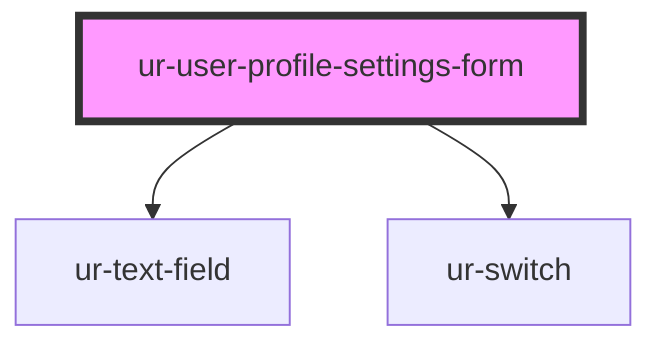

# ur-user-profile-settings-form

<!-- Auto Generated Below -->

## Properties

| Property                   | Attribute                     | Description                     | Type     | Default                                                                                                                                 |
| -------------------------- | ----------------------------- | ------------------------------- | -------- | --------------------------------------------------------------------------------------------------------------------------------------- |
| `aboutLabelText`           | `about-label-text`            |                                 | `string` | `'Tell the world something about you'`                                                                                                  |
| `emailLabelText`           | `email-label-text`            |                                 | `string` | `'Your email address'`                                                                                                                  |
| `emailTitleText`           | `email-title-text`            |                                 | `string` | `'Email'`                                                                                                                               |
| `facebookLabelText`        | `facebook-label-text`         |                                 | `string` | `'Your facebook public profile'`                                                                                                        |
| `facebookPrefixText`       | `facebook-prefix-text`        |                                 | `string` | `'facebook.com/'`                                                                                                                       |
| `facebookTitleText`        | `facebook-title-text`         |                                 | `string` | `'Facebook'`                                                                                                                            |
| `interactSubtitleText`     | `interact-subtitle-text`      |                                 | `string` | `'Fill in your social networks\' public profiles and your email address and give the opportunity to other people to interact with you'` |
| `interactTitleText`        | `interact-title-text`         |                                 | `string` | `'Interact'`                                                                                                                            |
| `linkedinLabelText`        | `linkedin-label-text`         |                                 | `string` | `'Your linkedin public profile'`                                                                                                        |
| `linkedinPrefixText`       | `linkedin-prefix-text`        |                                 | `string` | `'linkedin.com/in/'`                                                                                                                    |
| `linkedinTitleText`        | `linkedin-title-text`         |                                 | `string` | `'LinkedIn'`                                                                                                                            |
| `locationLabelText`        | `location-label-text`         |                                 | `string` | `'Location'`                                                                                                                            |
| `personalInfoSubtitleText` | `personal-info-subtitle-text` |                                 | `string` | `'Let other people know some things about you. These info will be shown in your profile'`                                               |
| `personalInfoTitleText`    | `personal-info-title-text`    |                                 | `string` | `'Personal info'`                                                                                                                       |
| `settings`                 | `settings`                    | The form values (settings data) | `any`    | `{}`                                                                                                                                    |
| `twitterLabelText`         | `twitter-label-text`          |                                 | `string` | `'Your twitter public profile'`                                                                                                         |
| `twitterPrefixText`        | `twitter-prefix-text`         |                                 | `string` | `'twitter.com/'`                                                                                                                        |
| `twitterTitleText`         | `twitter-title-text`          |                                 | `string` | `'Twitter'`                                                                                                                             |
| `websiteLabelText`         | `website-label-text`          |                                 | `string` | `'Your website / Blog'`                                                                                                                 |

## Events

| Event          | Description                         | Type                                          |
| -------------- | ----------------------------------- | --------------------------------------------- |
| `inputChanged` | Event emitted when an input changes | `CustomEvent<{ field: string; value: any; }>` |

## Dependencies

### Depends on

- [ur-text-field](../ur-text-field)
- [ur-switch](../ur-switch)

### Graph

----------------------------------------------

*Built with [StencilJS](https://stenciljs.com/)*
