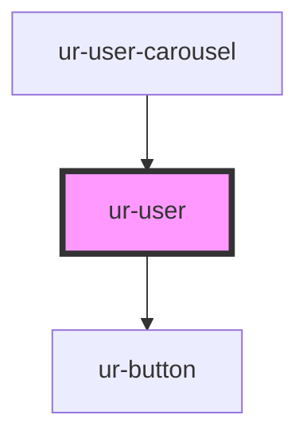

# ur-user

<!-- Auto Generated Below -->

## Properties

| Property            | Attribute             | Description | Type      | Default               |
| ------------------- | --------------------- | ----------- | --------- | --------------------- |
| `borderRadius`      | `border-radius`       |             | `string`  | `'8px'`               |
| `followStatus`      | `follow-status`       |             | `boolean` | `false`               |
| `followers`         | `followers`           |             | `number`  | `0`                   |
| `loading`           | `loading`             |             | `boolean` | `false`               |
| `showStats`         | `show-stats`          |             | `boolean` | `true`                |
| `userCover`         | `user-cover`          |             | `string`  | `undefined`           |
| `userCoverFallback` | `user-cover-fallback` |             | `string`  | `USER_COVER_FALLBACK` |
| `userDescription`   | `user-description`    |             | `string`  | `undefined`           |
| `userId`            | `user-id`             |             | `string`  | `undefined`           |
| `userTitle`         | `user-title`          |             | `string`  | `'User title'`        |

## Events

| Event               | Description | Type                  |
| ------------------- | ----------- | --------------------- |
| `userClicked`       |             | `CustomEvent<string>` |
| `userFollowClicked` |             | `CustomEvent<string>` |

## Dependencies

### Used by

 - [ur-user-carousel](../ur-user-carousel)

### Depends on

- [ur-button](../ur-button)

### Graph

----------------------------------------------

*Built with [StencilJS](https://stenciljs.com/)*
