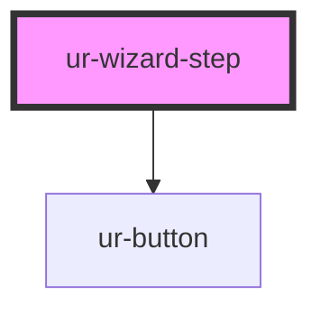

# ur-wizard-step

<!-- Auto Generated Below -->

## Properties

| Property              | Attribute               | Description                                    | Type      | Default      |
| --------------------- | ----------------------- | ---------------------------------------------- | --------- | ------------ |
| `customClass`         | `custom-class`          | Custom CSS class for the component             | `string`  | `undefined`  |
| `isSkippable`         | `is-skippable`          | Determines if the step can be skipped          | `boolean` | `false`      |
| `isValid`             | `is-valid`              | Validation state of the step                   | `boolean` | `true`       |
| `nextButtonTitle`     | `next-button-title`     | Title of the "Next" button                     | `string`  | `'Next'`     |
| `previousButtonTitle` | `previous-button-title` | Title of the "Previous" button                 | `string`  | `'Previous'` |
| `showNext`            | `show-next`             | Determines if the "Next" button is visible     | `boolean` | `true`       |
| `showPrevious`        | `show-previous`         | Determines if the "Previous" button is visible | `boolean` | `true`       |
| `step`                | `step`                  | Step number of the wizard                      | `number`  | `undefined`  |
| `stepTitle`           | `step-title`            | Title of the wizard step                       | `string`  | `undefined`  |
| `subtitle`            | `subtitle`              | Subtitle or instructions for the step          | `string`  | `undefined`  |
| `validationMessage`   | `validation-message`    | Custom validation message                      | `string`  | `undefined`  |

## Events

| Event           | Description                              | Type                                                                |
| --------------- | ---------------------------------------- | ------------------------------------------------------------------- |
| `stepBack`      | Event emitted when navigating back       | `CustomEvent<number>`                                               |
| `stepCompleted` | Event emitted when the step is completed | `CustomEvent<{ step: number; formData: { [key: string]: any; }; }>` |

## Methods

### `resetStepForm() => Promise<void>`

Reset the form within the step

#### Returns

Type: `Promise<void>`

### `submitStepForm() => Promise<void>`

Trigger form submission programmatically

#### Returns

Type: `Promise<void>`

## Dependencies

### Depends on

- [ur-button](../ur-button)

### Graph

----------------------------------------------

*Built with [StencilJS](https://stenciljs.com/)*
